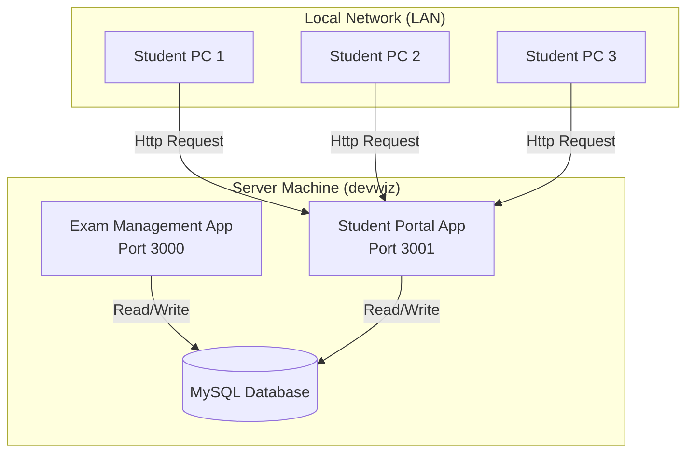

# CBT Exam Management System 🎓

A complete, offline-capable Computer-Based Test (CBT) system designed for LAN deployment.

## 🌟 How It Works

The system consists of **two** interconnected applications that share a single database:

1.  **Exam Management System (Admin)**
    *   **Purpose**: For lecturers and admins to create exams, manage questions, and view results.
    *   **URL**: `http://devwiz:3000` (or `http://localhost:3000` on server)
    *   **Features**: Dashboard, Course Management, Exam Creation, Results Analytics, Excel Export.

2.  **Student Portal**
    *   **Purpose**: For students to take scheduled exams.
    *   **URL**: `http://devwiz:3001`
    *   **Features**: Exam Login (Matric No), Timed Testing, Auto-submission, Instant Score (optional).

### 🏗️ System Architecture



---

## 🚀 Setup Guide

### 1. Prerequisites
Ensure you have the following installed on the **Server Machine**:
*   **Node.js** (v18 or higher)
*   **WampServer** (or MySQL) to run the database.

### 2. Network Configuration (The Easy Way)
Instead of using dynamic IP addresses that change, this system is configured to use your **Computer Name** (`devwiz`).

*   **Hostname**: `devwiz`
*   **Admin Address**: `http://devwiz:3000`
*   **Student Address**: `http://devwiz:3001`

**Note:** Ensure all student PCs are on the same WiFi/Network as this server.

### 3. Environment Variables
Ensure your `.env.local` files are configured as follows:

**`exam_management/.env.local`** (Admin):
```env
DB_HOST=localhost
DB_USER=root
DB_PASSWORD=
DB_NAME=cbt_exam_db
```

**`student/.env.local`** (Student):
```env
NEXT_PUBLIC_API_URL=http://devwiz:3000
DB_HOST=localhost
DB_USER=root
```
*(Note: Student app connects to Admin API for some functions)*

---

## ▶️ Running the System

You need to run **both** applications simultaneously.

### Option 1: Manual Start (Recommended for Dev)
Open **two** separate terminals:

**Terminal 1 (Admin):**
```bash
cd exam_management
npm run dev -- -H 0.0.0.0 -p 3000
```

**Terminal 2 (Student):**
```bash
cd student
npm run dev -- -H 0.0.0.0 -p 3001
```

### Option 2: Automatic Start
If you created a `start-server.bat` script, just double-click it.

---
to know system host name
ipconfig /all | findstr "Host Name"

## 👥 User Guide

### 👨‍🏫 For Administrators
1.  **Login**: Access `http://devwiz:3000`.
2.  **Create Course**: Go to Courses -> Add New Course.
3.  **Create Exam**: Go to Exams -> Create Exam -> Select Course -> Set Date/Time.
4.  **Add Questions**: Add questions manually or import.
5.  **Publish**: Set exam status to `ACTIVE` when ready.
6.  **Results**: After exam, go to "Results" to view scores and export Excel.

### 👩‍🎓 For Students
1.  **Access**: Open Browser -> Go to `http://devwiz:3001`.
2.  **Login**: Enter valid **Matric Number** (e.g., `COM/2024/001`).
3.  **Take Exam**: Click "Start Exam".
4.  **Submit**: Click "Submit" when done (or auto-submit when time is up).

---

## 🔧 Troubleshooting

| Issue | Solution |
|-------|----------|
| **"Site can't be reached"** | 1. Check if server is running.<br>2. Check if PC and Server are on same WiFi.<br>3. Try turning off Server Firewall temporarily. |
| **"Database Error"** | Ensure WampServer (MySQL) is running (Green Icon). |
| **"No Exams Found"** | Ensure Exam status is set to **ACTIVE** in Admin dashboard. |
| **"Failed to fetch"** | Check `.env.local` in student folder. URL must be `http://devwiz:3000`. |

---
*Built with ❤️ for SMATECH*
